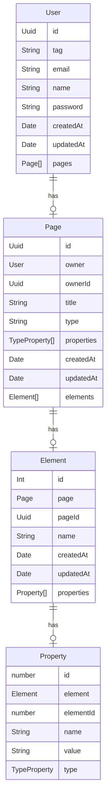

# Licest

> [!WARNING]
> This project is still in early developpment.

This repository contains the api of the Licest project.

## How to install
```bash
git clone git@github.com:LicestOrg/Api.git
cd Api
```

## How to use

> [!WARNING]
> Set the environment variables in the `.env` file.

> [!WARNING]
> This repository do not contain the production files and the database server.

Start the api server
```bash
npm ci
npm run start:dev
```

## The database schema


