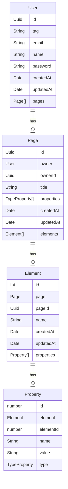

```mermaid
erDiagram

User ||--o| Page : has
User {
    Uuid            id

    String          tag
    String          email
    String          name
    String          password

    Date            createdAt
    Date            updatedAt

    Page[]          pages
}

Page ||--o| Element : has
Page {
    Uuid            id
    User            owner
    Uuid            ownerId

    String          title
    TypeProperty[]  properties

    Date            createdAt
    Date            updatedAt

    Element[]       elements
}

Element ||--o| Property : has
Element {
    Int             id
    Page            page
    Uuid            pageId

    String          name

    Date            createdAt
    Date            updatedAt

    Property[]      properties
}

Property {
    number          id
    Element         element
    number          elementId

    String          name
    String          value

    TypeProperty    type
}
```
